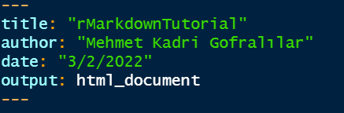

### **Headers** ( ' # ' )

# Header 1
## Header 2
### Header 3
#### Header 4
##### Header 5
###### Header 6
<br />

### **Links** ( ' < > ' )

<https://link.com>
<br /><br />

### **Italic** ( ' * * ' or ' _ _ ' )

*italic*

_italic_
<br /><br />

### **Bold** ( ' ** ** ' or ' __ __ ' )

**Bold**

__Bold__
<br /><br />

### **Superscript** ( ' ^ ^ ' )

superscript^n^
<br /><br />

### **Strikethrough** ( ' ~~ ~~ ' )

~~strikethrough~~
<br /><br />

### **Unordered List**:

* Item 1
* Item 2
    + Item 2a
    + Item 2b
<br /><br />

### **Ordered List**:

1. Item 1
2. Item 2
3. Item 3
    + Item 3a
    + Item 3b
<br /><br />

### **Tables**:

First Header  | Second Header
------------- | -------------
Content Cell  | Content Cell
Content Cell  | Content Cell
<br />

### **Inline Code** ( ' r ... ' )
Pi is approximately equal to `r 22/7` (r 22/7)
<br /><br />

### **Note**:
If you want to leave an empty line inbetween two lines, use ' < br / > ' two times. Because rmarkdown ignores extra spaces and new lines          like html. (usually)
<br /><br />

### **Code Chunks** ( '''{r, **parameters**} ''' )

<br /><br />

```{r}
library(knitr)

str(iris)
summary(iris)

str(cars)
summary(cars)
```

```{r}
kable(list(head(iris),head(cars)), format = "markdown")
```

### **Parameters**:

* You need to use `include = FALSE` parameter in order to prevent both the code chunk and the result from appearing in your report. But the code chunk will still run. For example:
<br /><br />

<br /><br />
```{r, include = FALSE}
a <- 'hidden code chunk runs'
```
```{r}
print(a)
```
<br /><br />

* You need to use `eval = FALSE` parameter in order to prevent the code chunk from working, but the code chunk will be printed. For example:
<br /><br />

<br /><br />
```{r, eval = FALSE}
a <- 'this code chunk will not work'
```
```{r}
print(a)
```
<br /><br />

* You need to use `echo = FALSE` parameter in order to prevent a code chunk from appearing in your report. For example:
<br /><br />

<br /><br />
```{r, echo=FALSE}
plot(iris)
```
<br /><br />

* You need to use `results='hide` parameter in order to prevent the output of a code chunk from appearing in your report. For example:
<br /><br />

<br /><br />
```{r, results='hide'}
print(a)
```
<br /><br />

* You need to use `message = FALSE` parameter in order to prevent the message from appearing in your report. For example:
<br /><br />


<br /><br />

* You need to use `error = TRUE` parameter in order to prevent the rendering process from stopping even if the code chunk gives an error. Although the error message will be printed. For example:
<br /><br />
```{r, error=TRUE}
plot(error)
```
<br /><br />